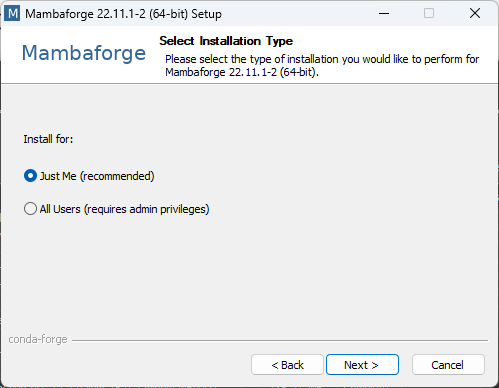
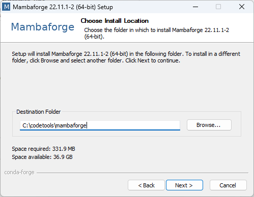
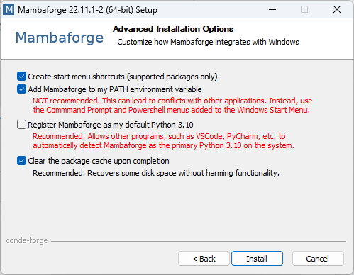

Setting up a robust coding environment for C++, Java, and Python in Windows can be a bit daunting, but with the right steps, it becomes a breeze. This guide will walk you through the entire process, ensuring you have a seamless setup. Let's dive in! 🚀

## Why Set Up a Coding Environment?

A well-configured coding environment can significantly enhance your productivity. Whether you're a beginner or an experienced developer, having the right tools and configurations can make your coding experience more enjoyable and efficient.

## Prerequisites

Before we begin, ensure you have the following:

- **Windows OS**: The latest updates installed.
- **7-Zip**: A decompressor to unzip `.7z` archives. Download it from [here](https://www.7-zip.org/).
- **VS Code**: A versatile code editor. Download it from [here](https://code.visualstudio.com/).

## **Step 1: Setting Up C++**

### Downloading WinLibs

WinLibs is a standalone build of GCC and MinGW-w64 for Windows. It includes various tools like GDB, GNU Binutils, GNU Make, and more.

#### WinLibs Build Details

WinLibs offers several builds tailored to different needs:

- **POSIX Threading Model**: Best for cross-platform compatibility.
- **WIN32 Threading Model**: Native Windows threading but lacks POSIX threads.
- **MCF Threading Model**: Introduced in GCC 13, offers better performance and features.

#### Runtime Library Options

- **MSVCRT**: Traditional runtime library, available on all Windows versions.
- **UCRT**: Universal C Runtime, available on Windows 10 and later, provides better standards conformance.

#### Download Syntax

Download the package with the following naming convention:

```
GCC xx.x.0 (with POSIX threads) + LLVM/Clang/LLD/LLDB xx.x.x + MinGW-w64 xx.x.x UCRT - release x - Win64
```

For example:

```
GCC 11.2.0 (with POSIX threads) + LLVM/Clang/LLD/LLDB 12.0.1 + MinGW-w64 9.0.0 UCRT - release 2 - Win64
```

1. **Download**: Visit [WinLibs](https://winlibs.com/) and download the Win64 - x86_64 (UCRT) version.
2. **Extract**: Use 7-Zip to extract the downloaded file to `C:/codetools/mingw64/`.
3. **Add to PATH**: Add `C:/codetools/mingw64/bin` to your Windows environment path.

### Configuring Environment Variables

1. **Open Control Panel**: Go to **System > Advanced system settings > Environment Variables**.
2. **Edit PATH**: Add `C:/codetools/mingw64/bin` to the **Path** variable.

### Verify Installation

Restart  Command Prompt and then open and type:

```shell
g++ --version
```

You should see the installed GCC version.

## **Step 2: Setting Up Python**

### Downloading Miniforge

Miniforge is a minimal installer for conda, specifically for conda-forge.

1. **Download**: Visit [Miniforge](https://github.com/conda-forge/miniforge#mambaforge) and download `Miniforge3-Windows-x86_64.exe`. Here the steps are shown in Mambaforge but Miniforge also have the same steps. 
2. **Install**: Run the installer and follow these steps:
   - **Step 1**: Install for "just me".
   - **Step 2**: Set the installation path to `C:\codetools\mambaforge`.
   - **Step 3**: Check "Add Mambaforge to my PATH environment variable". 
   - **Step 4**: Deselect "register XXX as my default python 3.XX".
   - **Step 5**: Wait for the installation to complete.

### Post-Install Configuration

Open the Miniforge CMD terminal and run:

```shell
conda config --set auto_activate_base false
conda config --set channel_priority strict
conda init --all
conda update --yes --all 
conda install --yes --name base mamba
```

### Verify Installation

Open Command Prompt and type:

```shell
python --version
```

You should see the installed Python version.

### Installation Images

**Step 1: Install for "just me".**



**Step 2: Set the path to install `C:\codetools\mambaforge`.**



**Step 3: Check “Add Mambaforge to my PATH environment variable”. Deselect "register XXX as my default python 3.XX".**



**Note**: The images are from the Mambaforge installer, but the steps are the same for Miniforge.

## **Step 3: Setting Up Java**

### Downloading OpenJDK

1. **Download**: Visit [OpenJDK](https://jdk.java.net/) and download the latest version. The latest version should be JDK XX, where XX is the version number.
2. **Extract**: Use 7-Zip to extract the downloaded file to `C:/codetools/jdk-xx/`.

### Configuring Environment Variables

1. **Open Control Panel**: Go to **System > Advanced system settings > Environment Variables**.
2. **Set JAVA_HOME**:
   - Click **New** under System Variables.
   - Enter `JAVA_HOME` as the variable name.
   - Enter `C:/codetools/jdk-xx` as the variable value.
3. **Edit PATH**: Add `%JAVA_HOME%\bin` to the **Path** variable.

### Verify Installation

Open Command Prompt and type:

```shell
java -version
```

You should see the installed JDK version.

## **Step 4: Configuring VS Code for Code Execution**

### Installing Code Runner

1. **Install Extension**: Open VS Code, go to the Extensions view, and search for "Code Runner". Install it.
2. **Configure Settings**:
   - Open `settings.json` by pressing `Ctrl+Shift+P` and searching for "settings json".
   - Add the following configurations:

```json
{
  "code-runner.executorMap": {
    "java": "cd $dir ; clear && javac $fileName && java $fileNameWithoutExt && Remove-Item $fileNameWithoutExt.class ",
    "cpp": "cd $dir ; clear && g++ $fileName -o $fileNameWithoutExt.exe && .\\$fileNameWithoutExt.exe && Remove-Item $fileNameWithoutExt.exe",
  }
}
```

### Verify Configuration

Create a simple Java or C++ file and run it using the Code Runner extension.

## Conclusion

Congratulations! You've successfully set up C++, Java, and Python in Windows. This setup will enhance your coding experience, making it more efficient and enjoyable. Happy coding! 🎉

This guide is designed to be comprehensive yet easy to follow, ensuring that even beginners can set up their coding environment without any hassle. If you found this guide helpful, don't forget to share it with your fellow developers!