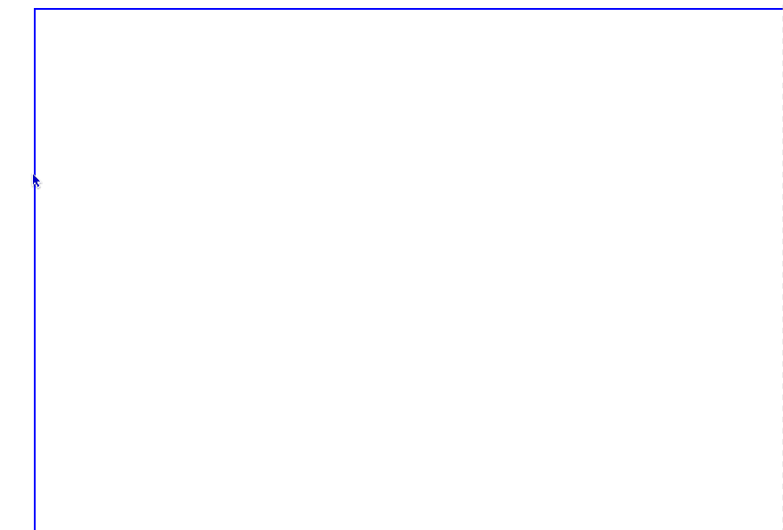
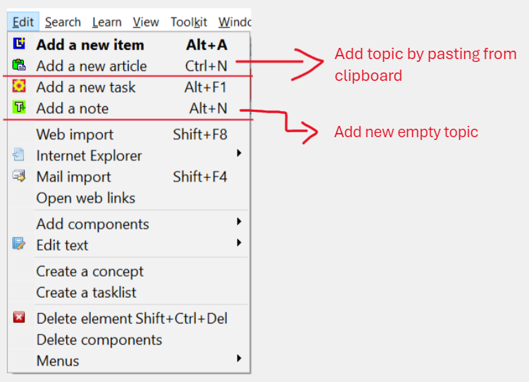
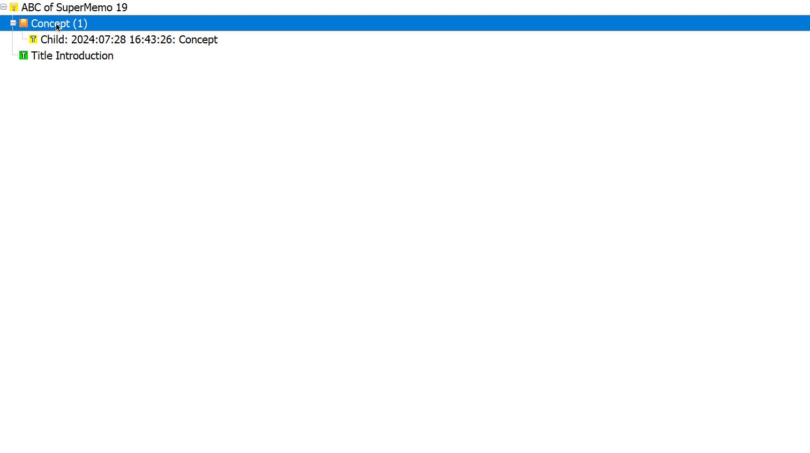

Supermemo is a powerful tool for enhancing learning efficiency through spaced repetition. This guide will walk you through the initial setup and optimization of Supermemo, ensuring you get the most out of this versatile software. Let's dive in! 🚀

## Why Use Supermemo?

Supermemo leverages spaced repetition, a learning technique that optimizes the intervals between reviews to maximize retention. By customizing your Supermemo environment, you can tailor the software to your learning style, making your study sessions more effective and enjoyable.

## Prerequisites

Before we begin, ensure you have the following:

- **Supermemo Software**: Download it from the [official website](https://www.supermemo.com/).
- **Unlock Password**: Obtain this from your Supermemo purchase confirmation email.

## Unlock Supermemo and Add Icons

1. **Input Password**: Open Supermemo and go to **File > Installation > Input password (`Ctrl+I`)**. Enter the unlock password received in your purchase confirmation email.
1. **Install Icons**: Go to **File > Installation > Install Icons**. This will add the necessary shortcuts if not already added.

## Change Layout, Theme, and Arrange Windows

### Change Layout and Set Theme

1. **Change Layout to Warrior Layout**: Go to **File > Level > Warrior Layout**. This layout provides access to all options.
1. **Set Your Favourite Theme (Eg. TabletDark Theme)**: Go to **Window > Themes > TabletDark**.

### Arrange Windows

1. **Customize Layout**: Adjust the window arrangement according to your preference.
   

#### Types of Windows

1. **Contents Window (`Alt+C`)**: Displays a hierarchical list of all elements.
2. **Elements Window**: Displays the learning material.
3. **Statistics Window**: Provides learning progress statistics.
4. **Element Data Window**: Shows details of the selected element.
5. **Status Bar**: Displays information and hints.
6. **Ancestor Window (`Shift+Ctrl+X`)**: Shows the hierarchy of concepts and topics.
   

### Save the Layout

1. **Save Default Layout**: Press **Shift+Ctrl+F5**.
2. **Save Custom Layout**: Go to **Window > Layout > Save custom layout**.
3. **Special Reserved Layouts**: In Supermemo you can save the layouts with name "Components" or "Browser" to have uniform Components and Browser Window Layout.
   

#### Other Settings

1. **Turn on Hints**: Go to **Window > Hint**.
2. **Disable Background**: Go to **Window > Layout > Background color** or **Background picture**.
3. The background will reveal other windows so it can be used when studying.
   

## Setting Up Templates

### Templates Overview

Templates define the look and feel of Supermemo elements.

1. **Set Right Template**: Always use the appropriate template for components.
2. **Detach Template**: Go to **Template > Detach template** to prevent modifications to previous items.
   
3. **Text Styles Registry**: Right-click in the active textbox, go to **Text > Style > Link Style**.
   
4. **Save Template**: Right-click outside the textbox or press **Alt+F10** and save the template.
   
5. **Apply Template**: Press **Ctrl+Shift+M** to change the current template.
6. **Modify Components**: Press **Esc** to exit modify mode.
   
7. **Delete Component**: Right-click the component and select **Delete Component**.
   
8. **Impose Template**: Press **Ctrl+Shift+F2** to set the current template as default for the specific element.
9. **Change Component Color**: Right-click the component, go to **Color > Custom Color**.
   
10. **Advanced Template Operations**: Refer to the [official documentation](https://help.supermemo.org/wiki/Templates#Advanced_template_operations).

## Understanding Supermemo Elements

### Elements Overview

1. **Active Element**: Item
2. **Passive Element**: Folder, Topic, Concept
   
3. **Remember/Forget/Dismiss**: Each element can be remembered, forgotten, or dismissed.
   

### Change Element Type

We can change element type from the Element window which can be activated using the shortcut `Ctrl+Shift+P`. 

1. After changing the Element also change the Element Template using the shortcut `Ctrl+Shift+M`. 

2. To change a Topic to Folder, Dismiss it using the shortcut `Ctrl+D`.  
3. To convert it to Concept, Activate it in Contents Window `Alt+C` and use shortcut `Ctrl+K`.

### Concepts

1. **Create Concept**: Use **Ctrl+K** in the **Contents Window** to convert the current branch into a concept.
   

### Topic/Folder

1. **Create Topic**: Use **Alt+N** to create an empty topic. Use **Ctrl+N** to create a topic from clipboard contents.
   
2. **Done/Dismiss Topic**: Use **Ctrl+D** to mark a topic as done. Use **Shift+Ctrl+Enter** to dismiss a topic.
   

### Browsing in Supermemo

1. **Branch Browser**: Use **Ctrl+Space** in the **Contents Window** or **Elements Window** to view descendants.
   
2. **Learn/Review**: Use **Ctrl+L** to start learning or reviewing elements.
3. **Outstanding Queue**: Use **View > Outstanding** or **Alt+V o** to view the outstanding queue for today.

## Studying In Supermemo

### Adding Question-Answer Cards

1. **Add New**: Use **Alt+A** to add a new question-answer card.
2. **Switch Components**: Use **Ctrl+T** to switch between question and answer components.
   

### Modifying Contents in the Article Element

1. **Delete Text**: Use **Alt+\\** to delete text before the cursor. Use **Alt+.** to delete text after the cursor.
2. **Undo**: Use **Alt+Backspace** to undo text editing.
3. **Edit Title**: Use **Alt+T** to edit the title or reference title.
4. **Repetition History**: Use **Shift+Ctrl+H** to display repetition history.
5. **Import File**: Use **Ctrl+Q** to import files.

### Setting Read-Point

1. **Set Read-Point**: Use **Ctrl+F7** to set a read-point.
2. **Go to Read-Point**: Use **Alt+F7** to go to the read-point.
3. **Clear Read-Point**: Use **Shift+Ctrl+F7** to clear the read-point.

### View Component in Default Software

1. **View Source Code**: Use **Shift+Ctrl+F6** to view HTML or RTF source code.
2. **View File**: Use **F9** to view the file associated with the component.
3. **Edit File**: Use **Ctrl+F9** to edit the file associated with the component.

### Navigation in Supermemo

1. **Ctrl+Up/Down**: Navigate to parent or last child element.
2. **Ctrl+Home/End**: Go to the first or last element in the knowledge tree.
3. **Ctrl+PgUp/PgDn**: Navigate to previous or next element.
4. **Alt+Left/Right**: Go back or forward in the element history.
5. **Alt+Home/End**: Go to the first or last element.

### Move the Current Element

1. **Move Element**: Use **Shift+Ctrl+V** to move the current element.
2. **Drag and Drop**: Drag and drop elements to move them.
   
   

## Setting Hooks in Supermemo

### Set Hook

1. **Set Hook**: Use **Alt+C** to view the concept window, right-click, and select **Concept > Set Hook**. Shortcut: **C E**.
   

## Adjusting Priorities and Intervals

### Prioritizing Elements

1. **Adjust Priority**: Use **Alt+P** to adjust the priority.
2. **Increase/Decrease Priority**: Use **Shift+Ctrl+Up/Down** to increase or decrease priority.

### Shortening Review Intervals

1. **Modify Interval**: Use **Ctrl+J** to modify the review interval.
2. **Postpone Review**: Use **Shift+Ctrl+J** to postpone the review.

### Workload

1. **Workload Calendar**: Use **Ctrl+W** to view the workload calendar.

### Adjust Proportion of Topics & Items

1. **Sorting Criteria**: Go to **Learn > Sorting > Sorting criteria**.
   

## Linking Concepts and Elements

### Element-to-Element Link

1. **Add to Link Registry**: Visit the element to be linked, right-click, and select **Concepts > Create Link**. Shortcut: **Shift+F10 c r**.
   
2. **Link Element**: From the element, right-click and select **Concepts > Link element**. Shortcut: **Shift+F10 c e**.
   

### Element-to-Concept Link

1. **Link Concept**: From the element, right-click and select **Concepts > Link concept**. Shortcut: **Shift+F10 c l**.
   

### Unlink from Concept/Element

1. **Unlink Concept**: Right-click and select **Concepts > Unlink concept**. Shortcut: **Shift+F10 c u**.
2. **Unlink Element**: Right-click and select **Concepts > Unlink element**. Shortcut: **Shift+F10 c n**.

## Zettelkasten Links in Supermemo

### Zettelkasten Links

1. **Get Element Number**: Visit the element to be linked, press **Ctrl+G** to get the element number.
2. **Insert HTML Link**: Select the text, right-click, and select **Insert HTML Link > Element Number**. Shortcut: **Shift+F12 l l**.
   

## Subset and Neural Review

### Subset Files

1. **Save All**: From the browser context menu, select **Subset > Save all**.
   
2. **Save Selection**: From the browser context menu, select **Select > Save selection**.
   
3. **Export Subset**: From the contents context menu, select **Export > Subset**.
   

### Subset Review

1. **Search and Review**: Use **Ctrl+F** to search, then **Ctrl+Shift+L** to review.
2. **Branch Review**: Select the branch in the **Contents Window**, then **Ctrl+Shift+L** to review.
3. **Random Review**: Open elements in the browser, randomize content with **Ctrl+Shift+F11**, then **Ctrl+Shift+L** to review.
4. **Semantic Review**: Use **Reference link** button, find relevant sub-branch, then **Ctrl+Shift+L** to review.

### Resume or Quit Subset Review

1. **Resume**: Use **Shift+Ctrl+Space** to resume subset learning.
2. **Quit**: Press **Esc**, then **Ctrl+L** and select **No** to exit subset review.
   

### Neural Review

1. **Start Neural Review**: Go to **Learn > Go neural** or use **Ctrl+F2**.
   
2. **Concept Registry**: Use **Search > Concepts**, select concepts, and start neural review.
   
3. **Browser Neural Review**: Use the context menu in the browser window.
   
4. **Quit Neural Review**: Press **Esc** several times before continuing/exiting neural review.
   

## To Set the Default Collection

1. **Edit supermemo.ini**: Change `"C:\SuperMemo\bin\supermemo.ini"` to set the default collection.
   

## Open Link in Default Browser

1. **Open in New Window**: Right-click the link and select **Open in new window**. Shortcut: **Rclick > n**.
   

## Conclusion

Congratulations! You've successfully set up and optimized Supermemo for effective learning. This setup will enhance your study sessions, making them more efficient and enjoyable. Happy learning! 🎉

This guide is designed to be comprehensive yet easy to follow, ensuring that even beginners can set up Supermemo without any hassle. If you found this guide helpful, don't forget to share it with your fellow learners!