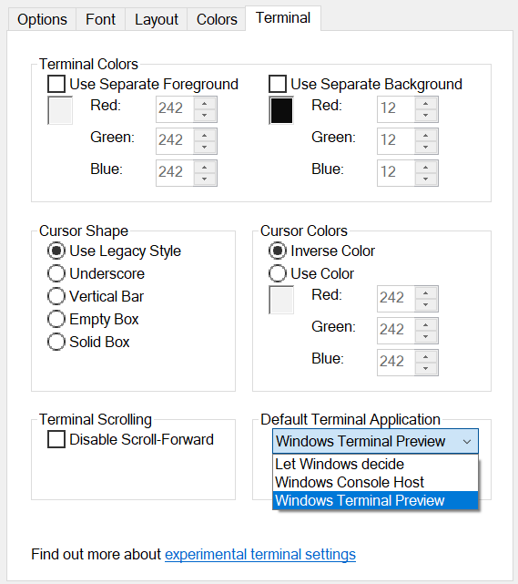

Setting up Windows Terminal in Windows 10 can significantly enhance your command-line experience. This guide will walk you through the entire process, ensuring you have a smooth and efficient setup. Let's dive in! 🚀

## Why Use Windows Terminal?

Windows Terminal is a modern, fast, and customizable terminal application for Windows. It supports multiple tabs, Unicode and UTF-8 character support, and a rich set of customization options. Whether you're a developer, system administrator, or just a power user, Windows Terminal can make your command-line tasks more enjoyable and productive.

## Prerequisites

Before we begin, ensure you have the following:

- **Windows 10**: The latest updates installed.
- **Microsoft Store**: Access to download applications.

## **Step 1: Downloading the Necessary Software**

From the Microsoft Store, install the following applications:

- [Windows Terminal](https://www.microsoft.com/store/productId/9N0DX20HK701)
- [Powershell Core](https://www.microsoft.com/store/productId/9MZ1SNWT0N5D)
- [Winget-cli](https://www.microsoft.com/store/productId/9NBLGGH4NNS1) (Windows Package Manager)

### Installation Steps

1. **Open Microsoft Store**: Search for each application and click "Get" to install.
2. **Verify Installation**: After installation, verify that each application is installed correctly by searching for them in the Start menu.

## **Step 2: Set Default Console Host as Windows Terminal in Windows 10**

### Update Your System

If you are on an earlier version of Windows 10, install the [KB5026435](https://www.catalog.update.microsoft.com/Search.aspx?q=KB5026435) update. This update enables you to set Windows Terminal as the default terminal application.

### Set Windows Terminal as Default

1. **Access Developer Settings**:
   - Go to **Settings > Update & Security > For Developers**.
   - Under the **Terminal** section, set the default terminal application to **Windows Terminal**.

   

2. **Configure Powershell Core**:
   - Navigate to `C:\ProgramData\Microsoft\Windows\Start Menu\Programs\PowerShell`.
   - Right-click on the Powershell shortcut and select **Properties**.
   - Go to the **Terminal** tab and set "Default Terminal Application" to **Windows Terminal**.

   

3. **Access Terminal Settings**:
   
   - After installing Windows Terminal v1.17, you can access settings by pressing `Ctrl+,`.
   - Set **Windows Terminal** as the "default terminal application".
   
   

## **Step 3: Add Windows Terminal To Win+X Menu**

### Script to Add Windows Terminal to Win+X Menu

1. **Create a Script**:
   - Create a file named `addTerminalToWinX.ps1` and copy the following code. The source of the script can be found [here](https://gist.github.com/fredrikhr/0994a6e81443c439659db1d9763365d7).

   ```powershell
   $folderPath = "$ENV:LOCALAPPDATA\Microsoft\Windows\WinX\Group3"
   $adminFilePath = Join-Path $folderPath "00 - Windows Terminal.lnk"
   $normalFilePath = Join-Path $folderPath "00a - Windows Terminal.lnk"
   $adminDisplay = "Windows Terminal (&Admin)"
   $normalDisplay = "Windows &Terminal"
   
   $shortcutFile = Join-Path $ENV:TEMP "Windows Terminal Shortcut.lnk"
   Invoke-WebRequest -OutFile $shortcutFile -Uri "https://gist.github.com/fredrikhr/0994a6e81443c439659db1d9763365d7/raw/Windows%2520Terminal%2520Shortcut.lnk"
   Copy-Item $shortcutFile $adminFilePath -Force -Verbose
   Copy-Item $shortcutFile $normalFilePath -Force -Verbose
   Remove-Item -Verbose -Force $shortcutFile
   
   # Get the Windows Shell COM service instance:
   $shell = New-Object -COM WScript.Shell
   
   # Change the Admin Shortcut display name (Description) and mark as Run as Administrator
   $adminShortcut = $shell.CreateShortcut($adminFilePath)
   $adminShortcut.Description = $adminDisplay # Set Display in Win+X menu using A as the mnemonic character
   $adminShortcut.Save()
   # Setting the Run as administrator flag does not have an API, flip the bit manually
   # ref.: https://stackoverflow.com/a/29002207/2226662
   $adminBytes = [System.IO.File]::ReadAllBytes($adminFilePath)
   $adminBytes[0x15] = $adminBytes[0x15] -bor 0x20 #set byte 21 (0x15) bit 6 (0x20) ON
   [System.IO.File]::WriteAllBytes($adminFilePath, $adminBytes)
   
   # Change the Normal Shortcut display name (Description)
   $normalShortcut = $shell.CreateShortcut($normalFilePath)
   $normalShortcut.Description = $normalDisplay # Set Display in Win+X menu using T as the mnemonic character
   $normalShortcut.Save()
   ```

2. **Run the Script**:
   - Open Powershell as Administrator and run the script:

   ```powershell
   .\addTerminalToWinX.ps1
   ```

3. **Restart Explorer**:
   - After the script runs, restart the `explorer.exe` shell from Task Manager.

4. If you wish to use custom shortcuts then the shortcut files in the WinX folder have to be hashed correctly to be accepted by Windows. There is a tool [hashlnk](https://github.com/riverar/hashlnk) that can be used to hash shortcut links. Here is an example to hash the ink file: 

   ```shell
   > hashlnk.exe "Windows Terminal Shortcut.lnk"
   
   HashLnk v0.2.0.0
   Copyright(c) 2012 Rafael Rivera
   Within Windows - http://withinwindows.com
   
   Hash generated and applied (0x4B665D57)
   ```

5. To apply the Windows Terminal shortcut for all new users on a Windows machine, you can modify the `AppData\Local` folder of the `Default` user instead. Therefore, change the following in the first line in the code snippet above to:

   ```powershell
   $folderPath = "C:\Users\Default\AppData\Local\Microsoft\Windows\WinX\Group3"
   ```

6. For more customization of the Win+X Folder see [Customizing the WinX menu, and making it user-specific](https://james-rankin.com/articles/customizing-the-winx-menu-and-making-it-user-specific/).
     - The entries that control the WinX menu are found in the folder at `%LOCALAPPDATA%\Microsoft\Windows\WinX`, and are subdivided into folders with names of `GroupX`. 
     - The Windows Terminal is ADDED in Group3 `%LOCALAPPDATA%\Microsoft\Windows\WinX\Group3`.

### Verify the Win+X Menu

After restarting, the Windows Terminal shortcuts should appear in the Win+X context menu.

## **Step 4: Setting Up Windows Terminal**

### Add a New Profile

To add a new profile in Windows Terminal, you need a GUID for your custom profile. Generate one using PowerShell:

```powershell
[guid]::NewGuid()
```

### Customize Windows Terminal

1. **Open Settings**: Press `Ctrl+,` to open the settings.
2. **Add Custom Actions**:

   ```json
   "actions": [
     {
       "command": { // To Summon Windows Terminal From any window if active
         "action": "globalSummon"
       },
       "keys": "alt+t"
     },
     { "command": "tabSearch", "keys": "ctrl+t" } // To Search TAB
   ]
   ```

### Launch From Explorer

In the address bar of File Explorer, type:

```bash
wt -d .
```

This command launches Windows Terminal in the current directory.

## Conclusion

Congratulations! You've successfully set up Windows Terminal in Windows 10. This setup will enhance your command-line experience, making it more efficient and enjoyable. Happy coding! 🎉

This guide is designed to be comprehensive yet easy to follow, ensuring that even beginners can set up Windows Terminal without any hassle. If you found this guide helpful, don't forget to share it with your fellow developers!