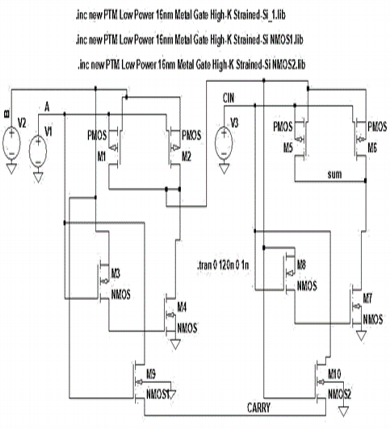
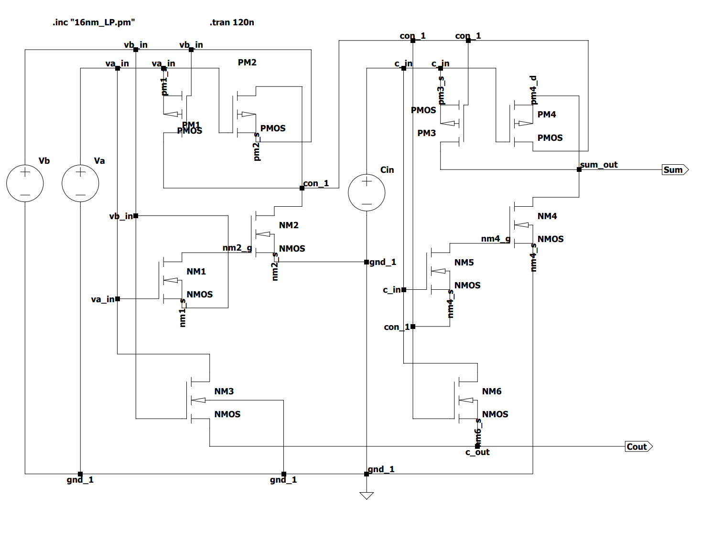
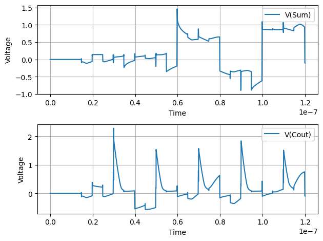

In the world of VLSI design, efficient circuit simulation is crucial for validating designs before fabrication. PySpice, a Python interface to the NGSpice simulation engine, offers a powerful toolset for performing Spice simulations. This guide will walk you through the process of setting up PySpice, designing an efficient 10T full-adder using Pass-Transistor Logic (PTL), and simulating it using the PTM 16nm library. Let's get started! 🚀

## **Installation**

As of the latest version, PySpice is at version 1.5, with NGSpice-34. Follow these steps to install PySpice on Windows:

```bash
pip install PySpice
pip install engineering-notation
pyspice-post-installation --install-ngspice-dll
pyspice-post-installation --check-install
```

**Optional**: To get the examples of PySpice, run:

```bash
pyspice-post-installation --download-example
```

Also, install Jupyter Notebook and create a new notebook named `fa-using-ptl.ipynb` to run the simulation step by step.

```bash
pip install jupyterlab
```

1. **Start JupyterLab:**

   ```bash
   jupyter lab
   ```

2. **Create a New Notebook:**

   - In JupyterLab, click on the "Python 3" icon under "Notebook" to create a new notebook.
   - Save the notebook as `fa-using-ptl.ipynb`.

3. **Run the Notebook:**

   - Write your code in the notebook cells.
   - Execute each cell by pressing `Shift + Enter`.

## **Efficient Full-Adder using 10T Pass Transistor Logic**

This logic was proposed by Bappy Chandra Devnath and Satyendra N. Biswas in their (CIET 2019) paper titled "*An Energy-Efficient Full-Adder Design Using Pass-Transistor Logic*". 

The paper introduces a new 10-transistor (10T) full adder design using PTL, aiming to reduce power consumption, minimize transistor count, and achieve high-speed operation in VLSI circuits.

### **Explanation of the Circuit**



The proposed 10T full adder is designed based on the following sum and carry equations:

$$
\text{Sum} = A \oplus B \oplus C_{in}
$$
$$
\text{Carry} = (A \oplus B) \cdot C_{in} + A \cdot B
$$

The circuit schematic is divided into two main parts:

1. **Sum Generation**: The upper 8 transistors (4 PMOS and 4 NMOS) are configured to generate the sum output. These transistors act as XOR gates to compute $A \oplus B$ and then $(A \oplus B) \oplus C_{in}$.
2. **Carry Generation**: The lower 2 NMOS transistors are used to generate the carry output. These transistors act as AND gates to compute $(A \oplus B) \cdot C_{in}$ and $A \cdot B$, and their outputs are combined to produce the carry signal.

### **Why the Circuit is Proposed**

1. **Reduced Transistor Count**: The proposed 10T full adder significantly reduces the number of transistors compared to conventional CMOS-based full adders, which typically require 28 or more transistors. This reduction leads to a smaller die area and lower power consumption.

2. **Low Power Consumption**: By using PTL, the circuit minimizes power dissipation. PTL is known for its ability to reduce power consumption by eliminating unnecessary switching activities and reducing the number of transistors that need to be powered.

3. **High-Speed Operation**: The design aims to achieve high-speed operation by minimizing the propagation delay. The use of PTL helps in reducing the delay associated with signal transmission through fewer transistors.

4. **Practical Transistor Model**: The circuit is simulated using a 16nm low-power high-k strained silicon transistor model from the PTM website. This practical model ensures that the design considerations are aligned with real-world fabrication technologies.

5. **Comparative Performance**: The paper compares the proposed 10T full adder with existing 6T adders in terms of power consumption, total delay, and Power-Delay Product (PDP). The results show that the proposed 10T adder offers superior compactness and power efficiency, although it has a slightly higher total average delay. However, the lower PDP indicates better overall energy efficiency.

### **Decoding the Circuit Diagram**



We will use `16nm_LP.pm` as stated in the paper. We will redesign the circuit using PySpice and do the simulation in a Jupyter notebook.

```python
# Import the necessary packages
import numpy as np
import matplotlib.pyplot as plt
import sys
import os

import PySpice

import PySpice.Logging.Logging as Logging
logger = Logging.setup_logging()

from PySpice.Spice.Netlist import Circuit
from PySpice.Unit import *

from PySpice.Spice.Library import SpiceLibrary
```

Now, we will import the `16nm_LP.pm` from the `/lib/` folder and define the circuit. As we do in Spice netlist, we include the library. Then, we define the circuit with the nodes and then define the MOSFETs with the library.

```python
# Include lib
spice_library = SpiceLibrary("../lib/")

# Defining the circuit
circuit = Circuit('Full Adder using PTL')

# Including the 16nm nmos and pmos
circuit.include(spice_library['nmos_16nm'])
circuit.include(spice_library['pmos_16nm'])

# Define the DC supply voltage value
Vdd = 0.9

# Defining the input voltages
circuit.PulseVoltageSource('A', 'va_in', circuit.gnd, initial_value=0, pulsed_value=0.9@u_V, 
                           delay_time=5@u_ns, rise_time=0.1@u_ns, fall_time=0.1@u_ns, 
                           pulse_width=5@u_ns, period=10@u_ns, phase=12)

circuit.PulseVoltageSource('B', 'vb_in', circuit.gnd, initial_value=0, pulsed_value=0.9@u_V, 
                           delay_time=10@u_ns, rise_time=0.1@u_ns, fall_time=0.1@u_ns, 
                           pulse_width=10@u_ns, period=20@u_ns, phase=6)

circuit.PulseVoltageSource('C', 'c_in', circuit.gnd, initial_value=0, pulsed_value=0.9@u_V, 
                           delay_time=20@u_ns, rise_time=0.1@u_ns, fall_time=0.1@u_ns, 
                           pulse_width=20@u_ns, period=40@u_ns, phase=3)

# Defining the NMOS
circuit.MOSFET('nm6', 'c_in', 'con_1', 'c_out', 'nm6_s', model='nmos_16nm')
circuit.MOSFET('nm3', 'va_in', 'vb_in', 'c_out', circuit.gnd, model='nmos_16nm')
circuit.MOSFET('nm2', 'con_1', 'nm2_g', circuit.gnd, 'nm2_s', model='nmos_16nm')

circuit.MOSFET('nm4', 'sum_out', 'nm4_g', circuit.gnd, 'nm4_s', model='nmos_16nm')
circuit.MOSFET('nm5', 'nm4_g', 'c_in', 'con_1', 'nm4_s', model='nmos_16nm')
circuit.MOSFET('nm1', 'nm2_g', 'va_in', 'vb_in', 'nm1_s', model='nmos_16nm')

# Defining the PMOS
circuit.MOSFET('pm2', 'con_1', 'va_in', 'vb_in', 'pm2_s', model='pmos_16nm')
circuit.MOSFET('pm4', 'sum_out', 'c_in', 'con_1', 'pm4_d', model='pmos_16nm')
circuit.MOSFET('pm3', 'sum_out', 'con_1', 'c_in', 'pm3_s', model='pmos_16nm')
circuit.MOSFET('pm1', 'con_1', 'vb_in', 'va_in', 'pm1_s', model='pmos_16nm')
```

Then, we will print the circuit. The netlist will be printed as follows:

```python
print(str(circuit))
```

Output:

```
.title Full Adder using PTL
.include path_to\lib\.ipynb_checkpoints\16nm_LP-checkpoint.lib
VA va_in 0 DC 0V PULSE(0V 0.9V 5ns 0.1ns 0.1ns 5ns 10ns 12s)
VB vb_in 0 DC 0V PULSE(0V 0.9V 10ns 0.1ns 0.1ns 10ns 20ns 6s)
VC c_in 0 DC 0V PULSE(0V 0.9V 20ns 0.1ns 0.1ns 20ns 40ns 3s)
Mnm6 c_in con_1 c_out nm6_s nmos_16nm
Mnm3 va_in vb_in c_out 0 nmos_16nm
Mnm2 con_1 nm2_g 0 nm2_s nmos_16nm
Mnm4 sum_out nm4_g 0 nm4_s nmos_16nm
Mnm5 nm4_g c_in con_1 nm4_s nmos_16nm
Mnm1 nm2_g va_in vb_in nm1_s nmos_16nm
Mpm2 con_1 va_in vb_in pm2_s pmos_16nm
Mpm4 sum_out c_in con_1 pm4_d pmos_16nm
Mpm3 sum_out con_1 c_in pm3_s pmos_16nm
Mpm1 con_1 vb_in va_in pm1_s pmos_16nm
```

Now, we will perform transient analysis of the circuit and plot the output.

```python
# Transient analysis
# Create a simulator
simulator = circuit.simulator(temperature=25, nominal_temperature=25)
simulator.options(double=True)
# Run a transient analysis
analysis = simulator.transient(step_time=0.1@u_ns, end_time=120@u_ns)

# Print the values
t1   = np.array(analysis.time)
sm1  = np.array(analysis['sum_out'])
cout = np.array(analysis['c_out'])

fig = plt.figure()

# Create the first subplot
plt.subplot(2, 1, 1)  
plt.plot(t1, sm1, label="V(Sum)")
plt.legend()
plt.xlabel("Time")
plt.ylabel("Voltage")
plt.grid()

plt.subplot(2, 1, 2)  # 
plt.plot(t1, cout, label="V(Cout)")
plt.legend()
plt.grid()
plt.xlabel("Time")
plt.ylabel("Voltage")

plt.tight_layout() 
plt.show()
```

Here is the output plot:



Finally, we print the power and delay of the circuit.

```python
# Get the current through the MOSFETs
i_pm3 = np.array(analysis['mpm3#dbody'])
i_pm4 = np.array(analysis['mpm4#dbody'])
i_nm4 = np.array(analysis['mnm4#dbody'])

# Get the voltage at the 'sum_out' node
v_sum_out = np.array(analysis['sum_out'])

# Calculate the power consumed by each MOSFET
p_pm3 = v_sum_out * i_pm3
p_pm4 = v_sum_out * i_pm4
p_nm4 = v_sum_out * i_nm4

# Calculate the total power at the 'sum_out' node
p_total = p_pm3 + p_pm4 + p_nm4

# Calculate the average power over the simulation time
p_avg = np.mean(p_total)

# Calculate the 10% and 90% levels
level_10 = 0.1 * np.max(v_sum_out)
level_90 = 0.9 * np.max(v_sum_out)

# Find the time when the signal crosses the 10% and 90% levels
step_time=0.1@u_ns
time_10 = np.where(v_sum_out > level_10)[0][0] * step_time
time_90 = np.where(v_sum_out > level_90)[0][0] * step_time

# Calculate the delay
delay = time_90 - time_10

print("Power(avg): ", p_avg, "Delay: ", delay)
```

So, the results are:

```
Power(avg):  0.6177999563430049 Delay:  24.700000000000003 ns
```

## **Conclusion**

In this guide we walked through the process of setting up PySpice, designing an efficient 10T full-adder using Pass-Transistor Logic (PTL), and simulating it using the PTM 16nm library. By following these steps, you can write and simulate your circuits in Python. Happy simulating! 🎉
