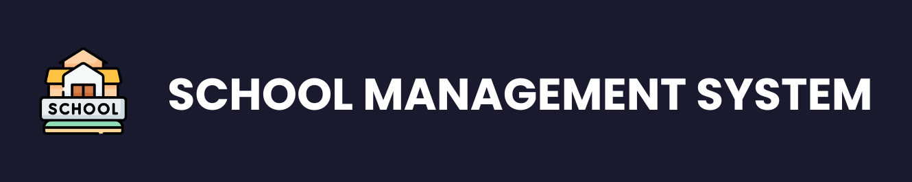
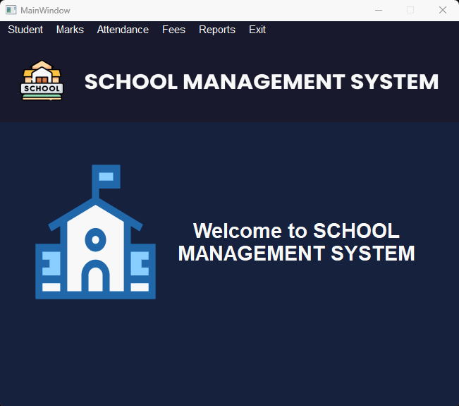
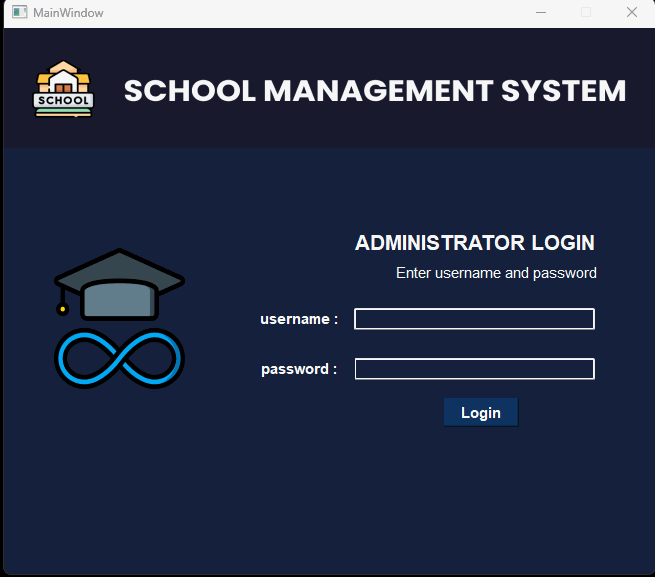
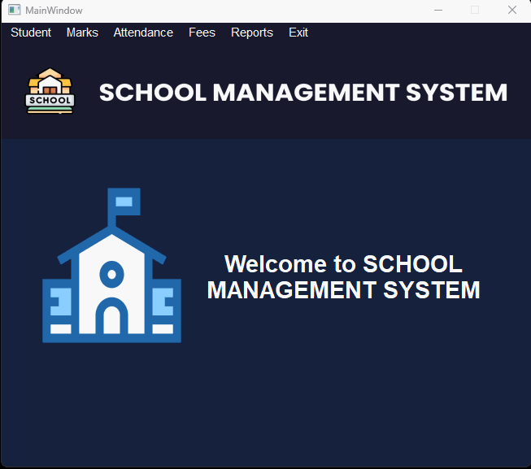
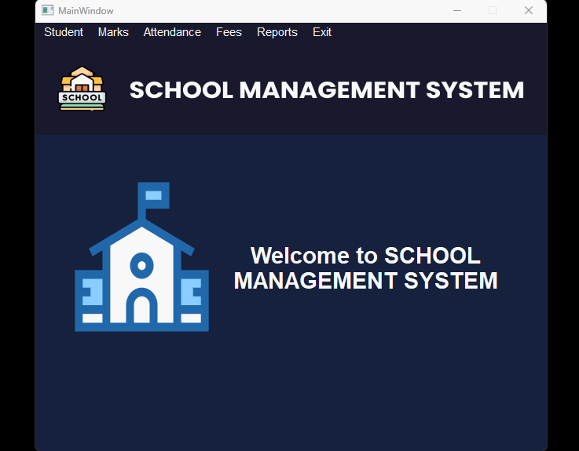

---

title: "School Management Software"
description: "A comprehensive CRUD school management system developed using Python, PyQt6, Qt Designer, and MySQL. Manage student registration, attendance, exams, fees, and generate detailed reports effortlessly."
tags: ["Python", "PyQt6", "MySQL", "School Management System", "CRUD Application"]
isNew: false
link: "https://github.com/ankitsamaddar/school_management_pyqt"
image: "./assets/school-management-system-python.png"

---

# School Management Software 🏫

This project is a CRUD school management system application developed using Python, PyQt6, Qt Designer, and MySQL. It offers a robust solution for managing student data, attendance, exams, fees, and generating various reports.

## Features 🌟

- **Student Registration:** Capture personal details and academic information.
- **Attendance Management:** Track student attendance efficiently.
- **Exam and Result Management:** Manage exam schedules and student results.
- **Fee Management:** Handle fee collection and tracking.
- **Reports Generation:** Generate detailed reports on student details, marks, attendance, and fees.

## Features Showcase 🎥

### Login Form 🔒

**Features:**

- **Login with Admin Credentials:** Secure access with admin credentials.
- **Prompt and Message for Invalid Credentials:** Immediate feedback for incorrect login attempts.
- **Logout Functionality:** Easily log out from the system.

| Login | Logout |
|-------|--------|
|  |  |

### Student Tab 📖

**Features:**

- **Add, Edit, and Delete Student Details:** Manage student information with ease.
- **Auto-Increment Registration Number:** Unique registration numbers are automatically generated.
- **Calculate Age from Date of Birth:** Automatically calculate the age based on the date of birth.

| Add New Student | Edit / Delete Student |
|-----------------|-----------------------|
|  |  |

### Marks Tab 📝

**Features:**

- **Add, Edit, and Delete Marks Details:** Manage student marks efficiently.
- **Fetch All Registration Numbers:** Easily access marks for any student.
- **Fetch Marks for Specific Exams:** Retrieve marks for particular exams.

| Add Marks | Edit / Delete Marks |
|----------|----------------------|
|  |  |

### Attendance Tab 📆

**Features:**

- **Add, Edit, and Delete Attendance Details:** Manage student attendance with ease.
- **Fetch All Registration Numbers:** Access attendance records for any student.
- **Fetch Attendance for Specific Dates:** Retrieve attendance for particular dates.
- **Set Add Attendance Tab Date to Current Date:** Automatically set the date to today.

| Add Attendance | Edit / Delete Attendance |
|----------------|--------------------------|
|  |  |

### Fees Tab 💵

**Features:**

- **Add, Edit, and Delete Fees Details:** Manage fee collections efficiently.
- **Set Add Fees Tab Date to Current Date:** Automatically set the date to today.
- **Set Add Fees Tab Month to Current Month:** Automatically set the month to the current one.
- **Fetch Fees Details for Specific Receipt Number:** Retrieve fees details for a particular receipt.
- **Print Preview and Print Functionality:** Easily print fees receipts.

| Add Fees | Edit / Delete Fees |
|---------|--------------------|
|  |  |

### Reports Tab 📊

**Features:**

- **Students Report:** Generate detailed reports on student information.
- **Marks Report:** Retrieve marks reports for students.
- **Attendance Report:** Generate attendance reports.
- **Fees Report:** Produce comprehensive fees reports.
- **Organized View of All Administrative Reports in One Place:** Access all reports effortlessly.

| View Reports |
|--------------|
|  |

---

This School Management Software is designed to streamline the administrative tasks of a school, making it easier to manage students, attendance, exams, fees, and more. With its intuitive interface and robust features, it's the perfect tool for any educational institution looking to enhance its management capabilities.