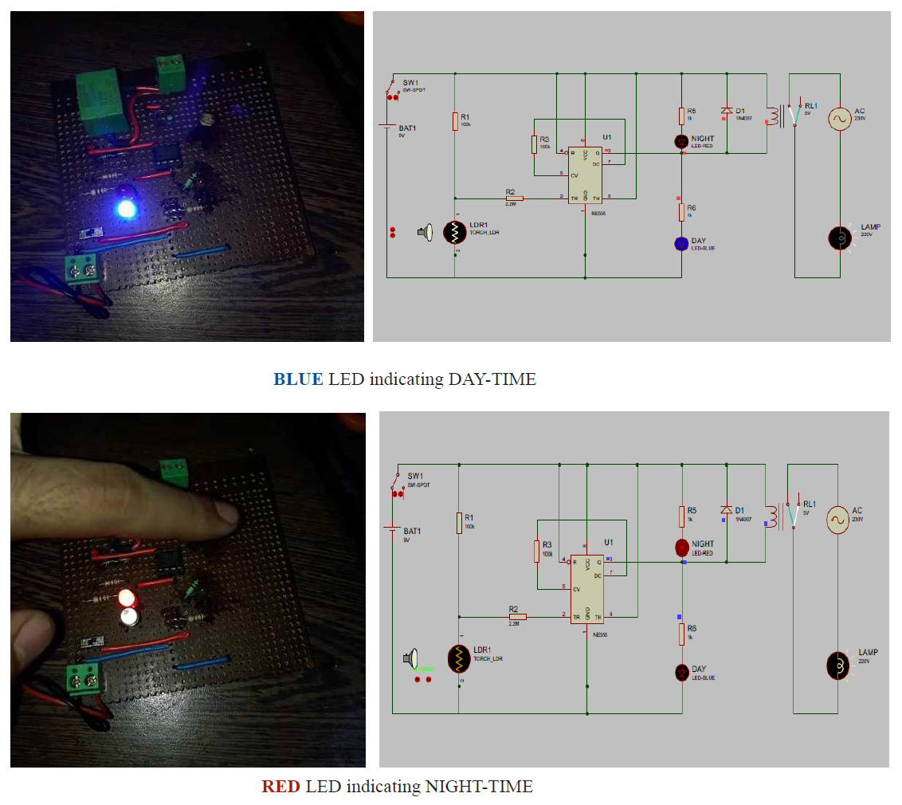
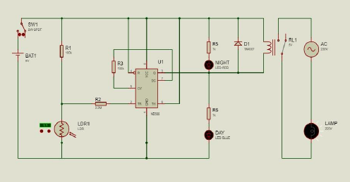

---

title: "Smart Street Light Control System with 555 Timer IC, LDR, and Relay"
description: "Implemented a smart street light control system using a 555 Timer IC, LDR, and relay for automated lighting based on ambient light levels. This project includes hardware and software components, focusing on electronic circuit design and simulation using Proteus. Ideal for controlling street lights efficiently in real-life applications."
tags: ["Smart Street Light", "555 Timer IC", "LDR", "Relay", "Proteus Simulation", "Electronic Circuit Design"]
isNew: false
link: "https://github.com/ankitsamaddar/smart-street-light-control-system-555-IC"
image: "./assets/demonstration_image.png" 

---

# Smart Street Light Control System with 555 Timer IC, LDR, and Relay 🌟

## Introduction 🌞

This project presents a smart street light control system that automatically manages lighting based on ambient light levels. Utilizing a 555 Timer IC, LDR, and relay, the system ensures efficient operation during both day and night. The design is complemented by software simulation using Proteus, making it a comprehensive solution for real-life applications.

## Hardware Required ⚙️

- **Timer IC**: NE555 (1)
- **LDR**: - (1)
- **Diode**: 1N4007 (2)
- **Resistor**: 1KΩ (2), 100KΩ (2), 2.2MΩ (1)
- **Relay**: 5V (1)
- **Battery**: 9V (1)

Simulated and testet the circuit using Proteus CAD Software. The Proteus simulation file is available in the repository, allowing you to test and  observe circuit behavior under various light conditions.

## Circuit Configuration 🛠️

The 555 timer IC is configured with specific pin connections:

- **Pin 5 & 7**: Connected by a 100k resistor, pulling Pin 5 to ground.
- **Pin 6 & 8**: Connected to Vcc.
- **Pin 4 & 1**: Connected to ground.
- **Pin 2**: Connected to LDR and 100k resistor via a 2.2M resistor.
- **Pin 3**: Output, high during day, low during night.

## Functionality 🚦

### Nighttime 🌙

- LDR resistance increases in low light, triggering the 555 timer.
- Output pin 3 goes low, illuminating the red LED and activating the relay for street lights.
- A flyback diode (1N4007) protects against voltage spikes.

### Daytime 🌞

- LDR resistance decreases in bright light, deactivating the 555 timer.
- Output pin 3 goes high, turning off the street lights.
- A blue LED indicates the off state.

---

This smart system efficiently manages street lighting, ensuring safety and energy savings. Dive into the repository for detailed implementation and simulation files! 🚀